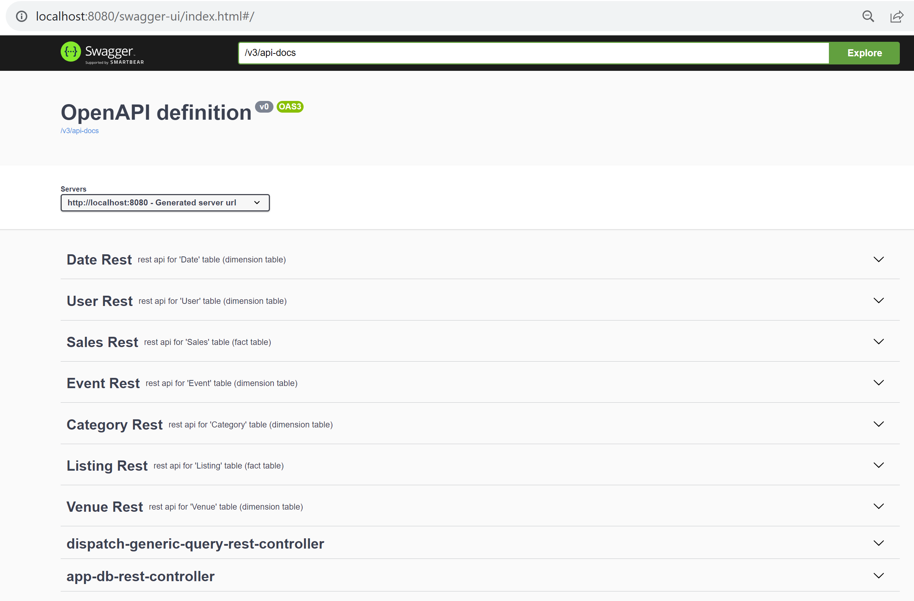

# Introduction

Simple Client + Server for exposing a "Self-BI" app on Http Rest JSON,
for exposing a sample star-schema database with 2 fact tables and 5 dimension tables. 

The csv database files are taken from Amazon Redshift sample: 
[https://docs.aws.amazon.com/redshift/latest/gsg/rs-gsg-create-sample-db.html]()
[https://docs.aws.amazon.com/redshift/latest/gsg/samples/tickitdb.zip]()

5 dimension tables:

- User
- Event
- Category
- Date
- Venue

2 Fact tables:

- Listing
- Sales


# Rest Server (using Springboot + embedded Spark standalone)

Pre-requisites: java (jdk >= 17) and maven.

Preferably launch from your IDE(IntelliJ), on main java class "fr.an.test.sparkserver.Main"

Notice you need few jvm arguments for jdk>=17 to be compatible with spark (not compiled using java jigsaw modules)
```
-Xmx3g
--add-opens=java.base/java.lang=ALL-UNNAMED
... and similar other, cf doc
```

)

When launching, you can test locally using Swagger, directly from your web browser.



cf doc for server
[server/README.md](server/README.md)


# Web User-Interface (using Angular)

Pre-requisites: nodeJs (and corresponding npm)

Launch using

```
cd ui
ng serve
```
